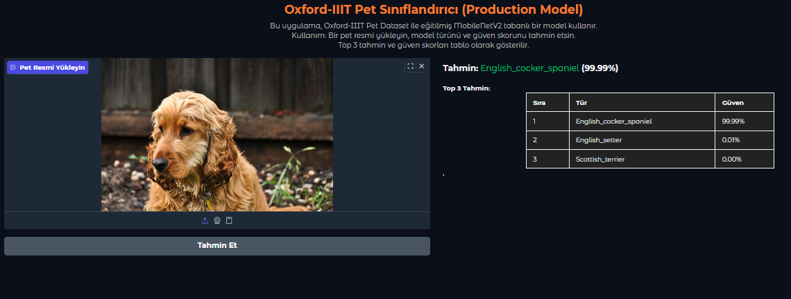

<<<<<<< HEAD
# Oxford-IIIT Pet Dataset: Transfer Learning & Production Pipeline


## Proje Özeti
Bu projede Oxford-IIIT Pet dataset üzerinde transfer learning ile farklı modeller karşılaştırılmış, en iyi model seçilerek production-ready bir pipeline ve modern web arayüzü geliştirilmiştir.

---

## 1. Transfer Learning Analizi Sonuçları

| Model           | Doğruluk (%) | Eğitim Süresi | Parametre Sayısı |
|-----------------|-------------|--------------|------------------|
| MobileNetV2     | 93.19       | 3281 sn      | 2,623,589        |
| ResNet50        | 10.82       | 10,959 sn    | 24,149,925       |
| EfficientNetB0  |  4.01       | 6,216 sn     | 4,415,176        |
| VGG16           | 62.63       | 49,591 sn    | 14,883,685       |

- MobileNetV2 modeli, doğruluk ve hız açısından en iyi sonucu verdi.
- VGG16 klasik ve güvenilir bir model olarak öne çıktı.
- ResNet50 ve EfficientNetB0 bu veri setinde düşük performans gösterdi.

---

## 2. Production Pipeline Sonuçları

- Model: MobileNetV2 (production-ready)
- Eğitim: 10 epoch transfer learning + 3 epoch fine-tuning
- Val accuracy (en iyi): %83.36
- Top-3 accuracy: %95.60
- Data augmentation, early stopping, fine-tuning, model checkpointing, metadata kaydı
- Model ve metadata kaydedildi: oxford_pets_production.h5, model_metadata.json

---

## 3. Web Arayüzü Özellikleri
- Modern ve kullanıcı dostu Gradio arayüzü
- Resim yükleyerek anında tahmin
- Top-3 tahmin ve güven skorları tablo şeklinde
- Türkçe ve açıklamalı UI

### Web Arayüzünde Sonuç Gösterimi
Web arayüzünde bir pet resmi yüklendiğinde, modelin tahmini ve top-3 tahmini tablo halinde ve görsel olarak vurgulanmış şekilde kullanıcıya sunulur. 
Aşağıda, arayüzdeki tahmin sonucunun ve top-3 tahmin tablosunun örnek bir ekran görüntüsünü bulabilirsiniz.



---

## Kullanım Adımları

1. Dataset’i indir ve dataset/images klasörüne çıkar.
2. Gerekli kütüphaneleri yükle:
   ```bash
   pip install -r requirements.txt
   ```
3. Model karşılaştırması için:
   ```bash
   python transfer_learning_analysis.py
   ```
4. Production-ready model için:
   ```bash
   python production_model.py
   ```
5. Web arayüzünü başlatmak için:
   ```bash
   python app_gradio.py
   ```

